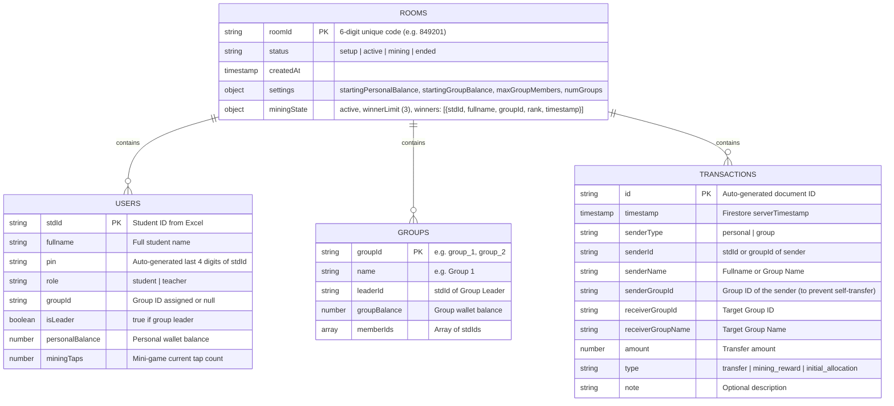

# Implementation Plan - Gamified Business Simulation Web App (`Biz-Simulate-app`)

Building a zero-server, real-time gamified business simulation web app designed for interactive classroom learning. Powered by React (Vite), TailwindCSS, Firebase Firestore (Real-Time NoSQL Database), and Firebase Auth, deployable to Vercel via GitHub CI/CD.

---

## Architecture & Database Schema Design

### Firestore NoSQL Database Schema Structure

We structure the database cleanly using room-scoped collections (`rooms/{roomId}/...`) to ensure full isolation per classroom session, efficient real-time listeners, simple cleanup, and clear security boundary enforcement.



---

## User Review Required

> [!IMPORTANT]
> **Key Business Logic & Security Enforcements:**
> 1. **Self-Transfer Restriction:** System strictly verifies `senderGroupId !== receiverGroupId` both on the client UI and inside Firestore database operations.
> 2. **Group Wallet Permissions:** Only the designated `isLeader` of a group is allowed to submit transactions originating from `groupBalance`.
> 3. **Real-time Freezing (End Game):** When the Teacher clicks "End Session", `rooms/{roomId}.status` shifts to `'ended'`. All transaction inputs and mining triggers become instantly disabled across all connected student browsers.
> 4. **Mining Race Integrity:** The first 3 students to reach 50 taps trigger an atomic transaction in Firestore to claim ranks 1st (e.g. +$500), 2nd (+$300), and 3rd (+$100).

---

## Proposed Technical Architecture & UI Components

### 1. Project Structure (`Biz-Simulate-app`)

```
Biz-Simulate-app/
├── public/
│   └── favicon.ico
├── src/
│   ├── assets/
│   ├── components/
│   │   ├── common/
│   │   │   ├── Navbar.jsx
│   │   │   ├── Badge.jsx
│   │   │   ├── Modal.jsx
│   │   │   └── AlertToast.jsx
│   │   ├── auth/
│   │   │   ├── TeacherLogin.jsx
│   │   │   └── StudentLogin.jsx
│   │   ├── teacher/
│   │   │   ├── RoomSetupModal.jsx
│   │   │   ├── ExcelImporter.jsx
│   │   │   ├── GroupManager.jsx
│   │   │   ├── LiveLeaderboard.jsx
│   │   │   ├── LiveTransactionLogs.jsx
│   │   │   └── MiningControlModal.jsx
│   │   ├── student/
│   │   │   ├── GroupSelection.jsx
│   │   │   ├── WalletPanel.jsx
│   │   │   ├── TransferModal.jsx
│   │   │   ├── StudentLeaderboard.jsx
│   │   │   └── MiningGameModal.jsx
│   │   └── end/
│   │       └── FinalSummaryView.jsx
│   ├── context/
│   │   ├── AuthContext.jsx
│   │   └── GameContext.jsx
│   ├── config/
│   │   └── firebase.js
│   ├── utils/
│   │   ├── excelParser.js
│   │   ├── pinGenerator.js
│   │   └── roomCodeGenerator.js
│   ├── App.jsx
│   ├── main.jsx
│   └── index.css
├── package.json
├── tailwind.config.js
├── postcss.config.js
├── vite.config.js
└── vercel.json
```

---

## Step-by-Step Execution Plan

### Phase 1: Project Initialization & Configuration
- Initialize Vite React app in root directory `./`.
- Install dependencies: `firebase`, `xlsx`, `lucide-react`, `canvas-confetti`, `tailwindcss`, `@tailwindcss/vite` (or standard PostCSS Tailwind v3/v4).
- Configure `firebase.js` with environment variable support (`VITE_FIREBASE_API_KEY`, `VITE_FIREBASE_PROJECT_ID`, etc.).

### Phase 2: Core Utility Modules & State Management
- `utils/excelParser.js`: Parses uploaded `.xlsx`/`.xls` files. **Robust HTML-table handling**: University systems often export `.xls` files that are raw HTML tables inside `.xls` containers. The parser reads array buffers with `xlsx` (SheetJS) and includes a `DOMParser` / regex fallback to extract `std_id` and `fullname` from HTML tables seamlessly. Auto-generates 4-digit PINs (`std_id.slice(-4)`).
- `utils/roomCodeGenerator.js`: Generates random 6-digit numeric Room Code.
- `AuthContext.jsx`: Manages active user session (Teacher or Student), storing current `roomId`, `stdId`, `role`, `isLeader`, and `groupId` in local state & localStorage for session persistence.
- `GameContext.jsx`: Provides real-time Firestore `onSnapshot` listeners for room metadata, groups list, user balances, mining race state, and live transaction logs.

### Phase 3: Teacher Dashboard Implementation
- **Room Creation & Setup**: Set dynamic initial parameters (Group starting balance, Personal starting balance, Max group members, Number of auto-generated groups).
- **Excel Student Roster Import**: Import Excel sheet, preview imported student list with auto-generated PINs, batch-write students to Firestore `rooms/{roomId}/users`.
- **Group Management & Override**: View groups and member rosters, trigger leader override button to appoint any group member as the new Leader.
- **Mining Mini-game Trigger**: Toggle "Start Mining Event" which updates `rooms/{roomId}.status = 'mining'`, resetting tap counts for all students.
- **Session Termination**: Toggle "End Session" which freezes room operations and opens celebration podium.

### Phase 4: Student Flow Implementation
- **Login**: Enter 6-digit Room Code + Student ID + 4-digit PIN.
- **Group Selection**: Pick an available group with slot counter (e.g. `2/5 members`). Automatically assigns first joiner as `Group Leader`.
- **Wallet & Transfers**:
  - Personal Wallet transfer form (Target group selector excluding student's own group, amount validation).
  - Group Wallet transfer form (Visible & enabled ONLY for `isLeader`).
  - Self-group transfer prevention algorithm and real-time transaction execution using Firestore atomic `runTransaction`.
- **Mining Clicker Mini-game**:
  - Interactive full-screen clicker overlay triggered dynamically on `status === 'mining'`.
  - Tap button 50 times with dynamic progress bar and visual feedback.
  - Sends atomic tap score update; upon reaching 50, registers as winner in `rooms/{roomId}.miningState.winners`. Top 3 claim reward payouts automatically!

### Phase 5: Deployment & CI/CD Setup
- Create `vercel.json` for SPA route rewrites.
- Provide environment variable setup guidelines for Vercel deployment.

---

## Verification Plan

### Automated & Manual Verification Tests
1. **Excel Parsing Test**: Upload sample Excel file with `std_id` (e.g. `65011234`) and `fullname` ("John Doe"), verify PIN generated is `1234`.
2. **Room Code & Auth Test**: Test student login with invalid PIN (fails) vs correct PIN & Room Code (succeeds).
3. **Group Allocation & Leader Rules**: Join empty group as 1st student -> verify `isLeader === true`. 2nd student joins -> verify `isLeader === false`. Test Teacher override -> verify leader flag switches seamlessly in real time.
4. **Self-Transfer Prevention Test**: Select student's own group in target dropdown -> verify dropdown disables student's own group and form validation blocks attempt.
5. **Insufficient Balance Test**: Attempt to transfer $500 with $100 balance -> verify error toast triggers and transaction fails.
6. **Mining Game Race Test**: Simulate 4 simultaneous student clickers tapping to 50 -> verify strictly top 3 receive reward tokens added to their balances.
7. **End Game Freeze Test**: Click "End Session" on Teacher dashboard -> verify all student screens switch to End Game view and transfer buttons are disabled.
